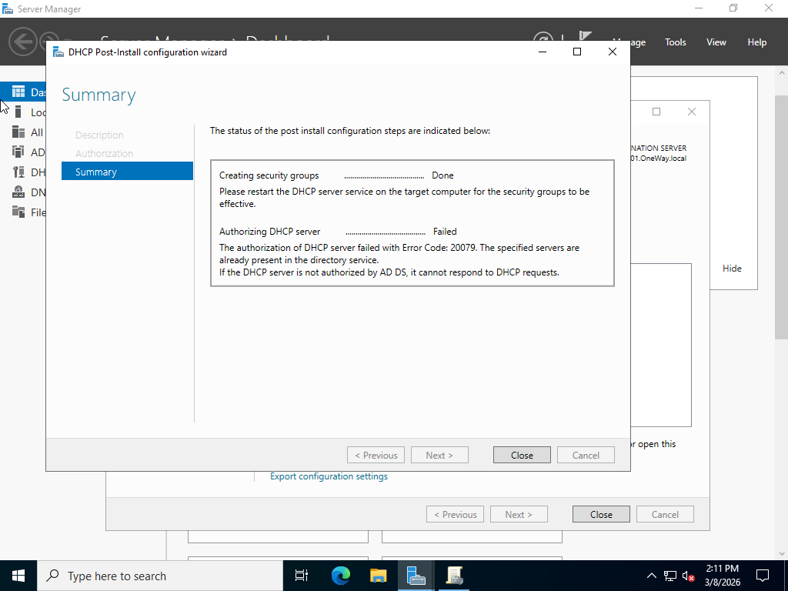
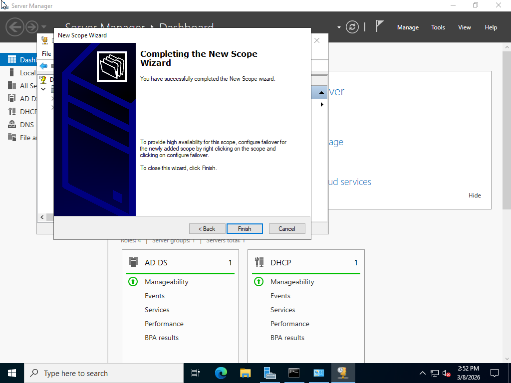
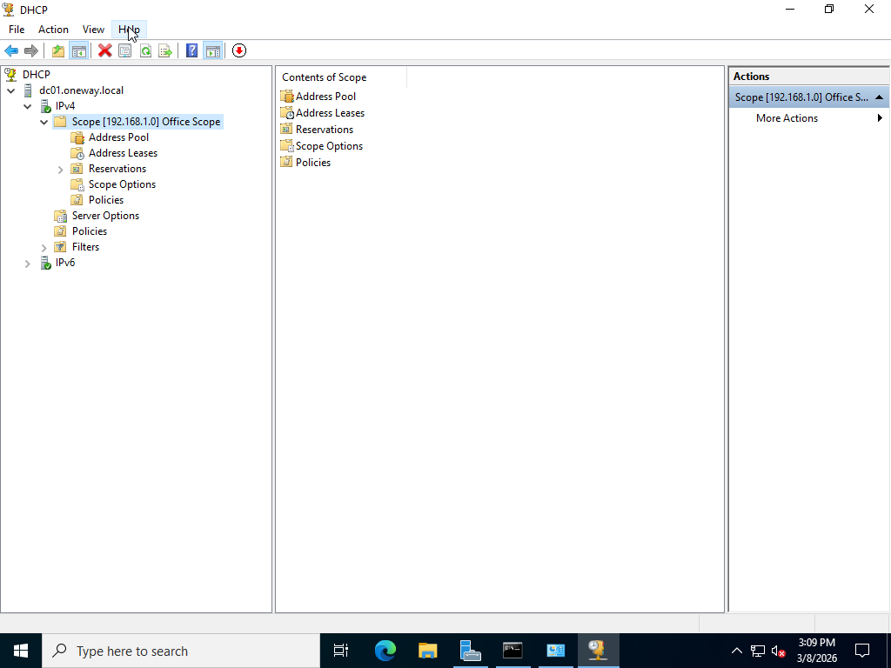
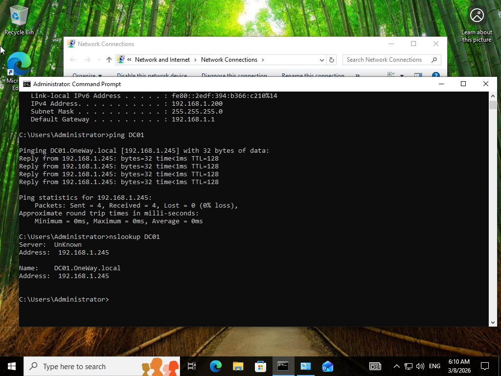

# DNS-DHCP-Lab
Configuring DNS and DHCP services in a Windows Server 2022 home lab environment.

# DNS & DHCP Lab

## Overview
This project demonstrates configuring DNS and DHCP services in a Windows Server environment using a small home lab.

The goal of this lab is to simulate a basic enterprise network where the server automatically assigns IP addresses to clients and resolves domain names.

---

## Lab Environment

- Windows Server 2022 (Domain Controller)
- Domain: OneWay.local
- Windows Client (Domain Joined)
- VMware Virtual Environment

---

## Network Architecture

DC01 → Domain Controller  
CLIENT → Domain Joined Machine

The server provides:
- Active Directory
- DNS
- DHCP

---

## Implemented Tasks

- Installed DHCP Server Role
- Authorized DHCP Server in Active Directory
- Created DHCP Scope
- Configured IP Range
- Configured DNS Server
- Tested DHCP IP Assignment
- Tested DNS Name Resolution

---

## DHCP Scope Configuration

Start IP:
192.168.1.200

End IP:
192.168.1.250

Subnet Mask:
255.255.255.0

DNS Server:
192.168.1.245

---

## Skills Learned

- DHCP Configuration
- DNS Name Resolution
- Windows Server Network Services
- Network Infrastructure Basics
- Troubleshooting DHCP issues

---

## Screenshots

### DHCP Server Installation

### DHCP Scope Configuration

### DHCP Scope Active

### Client IP Address via DHCP

### DNS Name Resolution Test

---
